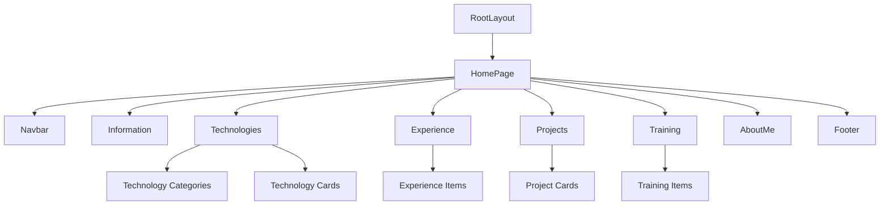

# System Patterns

## System Architecture

- The portfolio is built using Next.js 14+ with the App Router for efficient routing and rendering.
- TypeScript is used for type safety and better developer experience.
- Tailwind CSS is used for styling, ensuring a consistent and responsive design.
- The architecture follows a component-based design with clear separation of concerns.
- Custom CSS variables are used for theming with dark mode support.

## Key Technical Decisions

- Use of Next.js App Router for modern and scalable routing.
- TypeScript for type safety and better code quality.
- Tailwind CSS for rapid UI development and customization.
- Geist font family for modern typography.
- CSS variables for theming and dark mode support.
- Component-based architecture for better maintainability.

## Design Patterns

- Component-based architecture for modular and reusable UI elements.
- Section-based layout for clear content organization.
- Responsive design principles to ensure compatibility across devices.
- Progressive disclosure pattern for experience and project details.
- Custom animations for enhanced user experience.
- CSS-in-JS for component-specific styling.

## Component Relationships

- The Navbar component provides navigation to all sections.
- Each section (Information, Technologies, Experience, Projects, Training, AboutMe) is a self-contained component.
- The Technologies section contains categorized technology cards with proficiency levels.
- The Experience and Training sections contain expandable items with details.
- The Projects section contains project cards with details, links, and technology tags.
- The AboutMe section provides personal information and approach.
- All components use shared styling through Tailwind CSS classes.
